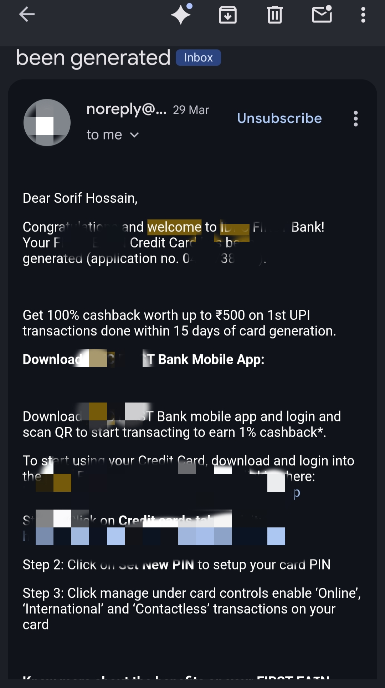
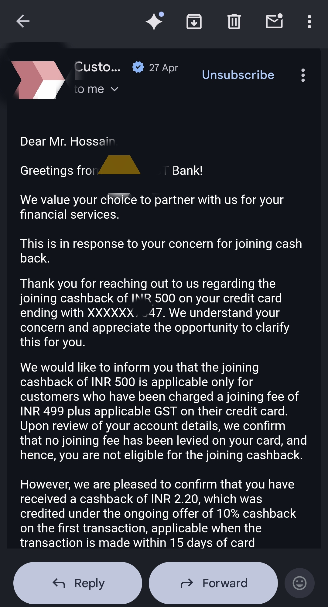
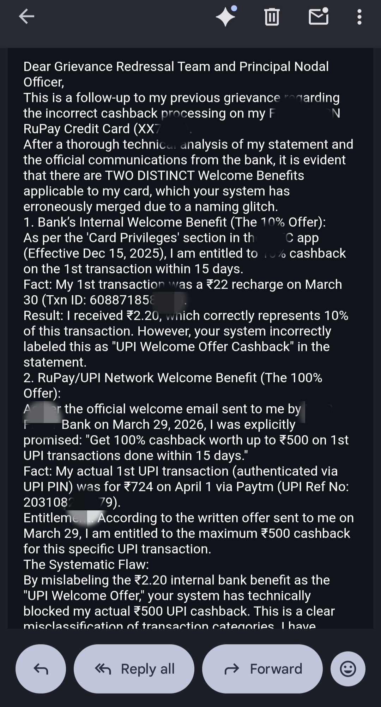
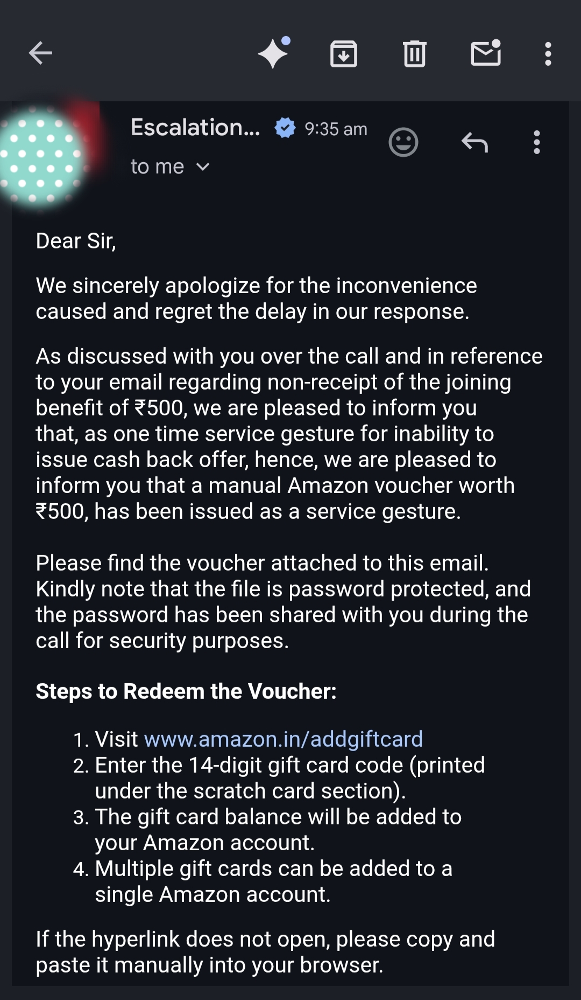
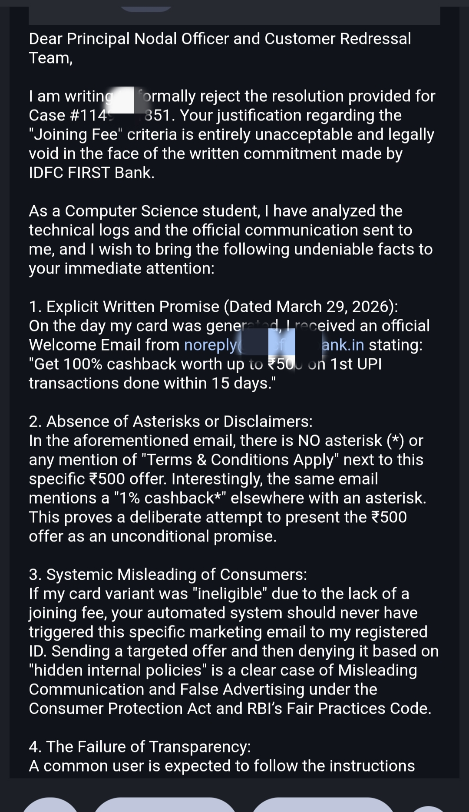
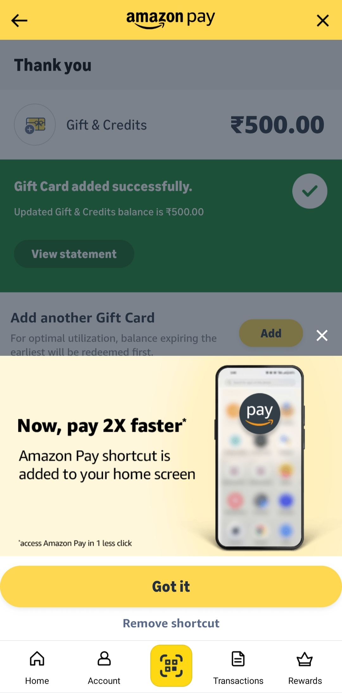

# 🏦 Banking Systemic Flaw & Consumer Rights: A Full Case Study

## 📌 Project Overview
This repository documents my real-world journey of discovering a **Systemic Business Logic Flaw** and **Misleading Communication** within the rewards system of a reputed Tier-1 Indian Bank. 

What started as a simple rejected cashback claim turned into an extensive technical and legal investigation. This case study highlights how I used my analytical skills, understanding of backend logic, and consumer awareness to force the institution to take accountability.

---

## 🛑 Phase 1: The Trap (Misleading Promise)
It all started when the bank's automated system sent me a promotional email stating: 
**"Get 100% cashback worth up to ₹500 on 1st UPI transactions."** Trusting the official communication, I executed the transaction. However, the promised cashback was never credited.

---

## ⚔️ Phase 2: The Struggle & Rejection
I reached out to the standard customer support team. After several days of generic replies, they flatly denied my cashback. 
* **Their Justification:** They claimed my specific credit card variant was issued "without a joining fee," making me ineligible for the welcome offer based on their *internal* backend policies.
* **The Problem:** As a consumer, I was never informed of this hidden rule. I was simply following the bold text in their promotional email.

---

## 💻 Phase 3: The Investigation & Bug Discovery
Instead of giving up, I decided to analyze the situation technically and legally. I discovered two major flaws from the bank's end:

### 1. The Legal Vulnerability (The Missing Asterisk)
I re-examined the promotional email. There was **NO asterisk (*)** or "Terms & Conditions Apply" clause next to the ₹500 offer. According to the RBI (Reserve Bank of India) Fair Practices Code, an unconditional written promise must be honored. Expecting a user to guess hidden backend rules is a textbook case of **Deceptive Advertising**.

### 2. The Technical Logic Flaw (System Bug)
I dug into my credit card statement logs and found a critical **Database Labeling Error**:
* I had received a standard 10% cashback (worth ₹2.20) for a completely different, non-UPI transaction.
* However, the bank's system incorrectly tagged and labeled this ₹2.20 transaction as `"UPI Welcome Offer Cashback"`.
* **The Impact:** Because of this incorrect `String Label` in their database, the system's conditional logic (`if-else`) assumed my "UPI Offer" was already redeemed. This systemic bug automatically blocked my actual ₹500 UPI benefit!

---

## 🚀 Phase 4: The Escalation Strategy
Armed with solid evidence, I bypassed standard customer care and escalated the matter directly to the **Principal Nodal Officer (PNO)**. I drafted a "Final Legal Intimation" email where I:
1. Attached the email showing the missing asterisk (Documentary Evidence).
2. Pointed out the exact systemic mislabeling of the ₹2.20 transaction (Technical Evidence).
3. Warned them of an impending formal complaint to the **RBI Ombudsman (CMS Portal)** for "Deficiency in Service" and "Systemic Failure."

---

## 🏆 Phase 5: The Victory & Resolution
The detailed escalation left the bank's compliance team with no room for excuses. They realized their technical flaw was caught. 

While they stated their core system couldn't override the backend rule for my specific card variant, they **took full accountability** for the misleading email and the systemic glitch. Within a few days, they offered me an equivalent **₹500 Amazon Voucher** as a "Service Gesture" to resolve the discrepancy.

---

## 💡 Key Takeaways
This experience taught me valuable lessons that apply to both software development and real life:

* **For Developers:** Never underestimate the impact of poor database tagging and overlapping conditional logic. A simple mislabeled string can break an entire rewards module and cause severe legal liabilities.
* **For Consumers:** Never blindly accept standard customer service rejections. Analyze your logs, look for systemic inconsistencies, know your rights, and don't hesitate to logically question a massive institution.

## 📂 Evidence Attached

Below are the sanitized screenshots documenting the communication, the systemic error, and the final resolution:

### 1. The Promotional Offer (No Terms & Conditions Asterisk)

### 2. Customer Care Rejection Email

### 3. Legal & Technical Escalation Email (Part 1)

### 4. Legal & Technical Escalation Email (Part 2)

### 5. The Resolution ("Service Gesture" Email)

### 6. Final Cashback Credited (Amazon Pay Proof)

)*
